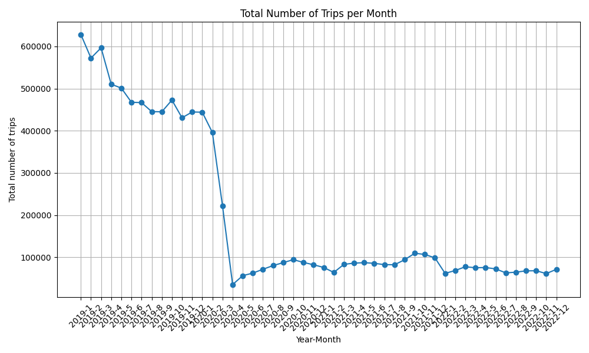

  
  # :taxi: Means of Transport: A Data Visualization Project :bike:

<table border="0" align="center" cellspacing="0" cellpadding="0" bgcolor="#fff">
  <tr>
    <td cellspacing="0" cellpadding="0" colspan="3"><strong>Group Name</strong> Out of Touch</td>
  </tr>
  <tr>
    <td cellspacing="0" cellpadding="0"><strong>Bojan Lazarevski</strong> 375261</td>
    <td cellspacing="0" cellpadding="0"><strong>Rares-Stefan Epure</strong> 359773</td>
    <td cellspacing="0" cellpadding="0"><strong>Cristian-Alexandru Botocan
</strong> 358786</td>
  </tr>
</table>
  
  *As part of the course "Data Visualization COM-480" at EPFL*
  
  [**Milestone 1**](#milestone-1) • [Milestone 2](#milestone-2) • [Milestone 3](#milestone-3)
  

## Milestone 1

### Dataset
We will visualize 2 means of transport in New York City, taxi and bike rides. The analysis and visualizations will be complementary focused on the following 3 periods: pre, during and post COVID pandemic.

_Note: The datasets were filtered to contain entries only between 2019-2022 corresponding to the COVID pandemic period._

- **Taxi Rides**: [NYC Open Data](https://opendata.cityofnewyork.us/data/) ([2019](https://data.cityofnewyork.us/Transportation/2019-Green-Taxi-Trip-Data/q5mz-t52e/about_data), [2020](https://data.cityofnewyork.us/Transportation/2020-Green-Taxi-Trip-Data/pkmi-4kfn/about_data), [2021](https://data.cityofnewyork.us/Transportation/2021-Green-Taxi-Trip-Data/djnb-wcxt/about_data), [2022](https://data.cityofnewyork.us/Transportation/2022-Green-Taxi-Trip-Data/8nfn-ifaj/about_data))

  Contains the zones/timestamps for pickup and dropoff as well as the cost of the ride, broke in multiple parts such as **fare_amount**, **tolls_amount**, **tip_amount** and others:
  
  <table border="0" cellspacing="0" cellpadding="0" bgcolor="#fff">
    <tr>
      <td cellspacing="0" cellpadding="0" colspan="3"><strong>lpep_pickup_datetime</strong></td>
      <td cellspacing="0" cellpadding="0" colspan="3"><strong>lpep_dropoff_datetime</strong></td>
      <td cellspacing="0" cellpadding="0" colspan="3"><strong>PULocationID</strong></td>
      <td cellspacing="0" cellpadding="0" colspan="3"><strong>DOLocationID</strong></td>
      <td cellspacing="0" cellpadding="0" colspan="3"><strong>trip_distance</strong></td>
      <td cellspacing="0" cellpadding="0" colspan="3"><strong>fare_amount</strong></td>
      <td cellspacing="0" cellpadding="0" colspan="3"><strong>extra</strong></td>
      <td cellspacing="0" cellpadding="0" colspan="3"><strong>mta_tax</strong></td>
      <td cellspacing="0" cellpadding="0" colspan="3"><strong>tip_amount</strong></td>
      <td cellspacing="0" cellpadding="0" colspan="3"><strong>tolls_amount</strong></td>
      <td cellspacing="0" cellpadding="0" colspan="3"><strong>improvement_surcharge</strong></td>
      <td cellspacing="0" cellpadding="0" colspan="3"><strong>total_amount</strong></td>
    </tr>
  </table>

  The above columns are final, after filtering out the data related to the gender and type of payment. In order to maintain the corectness of our data, we kept the entries, where the trip_distance is between 0 and 100 miles. This dataset includes 2 special zones (**Unkown** and **Outside of NY**), which were removed from the final dataset.
    
- **Bike Rides**: [City Bike NYC](https://s3.amazonaws.com/tripdata/index.html)

  Contains precise timestamp and geolocation of the start and end of a bike ride.

  <table border="0" cellspacing="0" cellpadding="0" bgcolor="#fff">
    <tr>
      <td cellspacing="0" cellpadding="0" colspan="3"><strong>starttime</strong></td>
      <td cellspacing="0" cellpadding="0" colspan="3"><strong>stoptime</strong></td>
      <td cellspacing="0" cellpadding="0" colspan="3"><strong>start_lat</strong></td>
      <td cellspacing="0" cellpadding="0" colspan="3"><strong>start_lng</strong></td>
      <td cellspacing="0" cellpadding="0" colspan="3"><strong>end_lat</strong></td>
      <td cellspacing="0" cellpadding="0" colspan="3"><strong>end_lng</strong></td>
    </tr>
  </table>

  The size of this dataset was initially 10Gb, restraining our storage capacities. Therefore, we decide to load every 10th row, but still represent an equivalent data distribution as the original dataset, shrkinging the dataset to 1Gb. In order to compare the statistics with the taxi dataset, based on the geolocations, 5 new fields are computed and added as part of the final dataset: start/end zone and borough and distance travelled. The dataset contains very little NaN and duplicate values.
  
- **Bike Accidents**: [Crashes From NYC](https://data.cityofnewyork.us/Public-Safety/Motor-Vehicle-Collisions-Crashes/h9gi-nx95/about_data)

  The last dataset used comprises all the crashes from NYC from 2016 until now. So, we filtered the dataset in order to keep just the accidents which involves at least one bicycle and occurred between 2019 and 2022.

_General initial statistics of the datasets:_

<table border="0" cellspacing="0" cellpadding="0" bgcolor="#fff">
    <tr>
      <td cellspacing="0" cellpadding="0" colspan="3"><strong>Dataset</strong></td>
      <td cellspacing="0" cellpadding="0" colspan="3"><strong>Size</strong></td>
      <td cellspacing="0" cellpadding="0" colspan="3"><strong>Entries</strong></td>
      <td cellspacing="0" cellpadding="0" colspan="3"><strong>NaNs</strong></td>
      <td cellspacing="0" cellpadding="0" colspan="3"><strong>Duplicates</strong></td>
    </tr>
    <tr>
      <td cellspacing="0" cellpadding="0" colspan="3">Taxi Rides</td>
      <td cellspacing="0" cellpadding="0" colspan="3">960MB</td>
      <td cellspacing="0" cellpadding="0" colspan="3">9,7M</td>
      <td cellspacing="0" cellpadding="0" colspan="3">0</td>
      <td cellspacing="0" cellpadding="0" colspan="3">0</td>
    </tr>
    <tr>
      <td cellspacing="0" cellpadding="0" colspan="3">Bike Rides</td>
      <td cellspacing="0" cellpadding="0" colspan="3">10GB</td>
      <td cellspacing="0" cellpadding="0" colspan="3">100M</td>
      <td cellspacing="0" cellpadding="0" colspan="3">9772</td>
      <td cellspacing="0" cellpadding="0" colspan="3">24</td>
    </tr>
    <tr>
      <td cellspacing="0" cellpadding="0" colspan="3">Bike Accidents</td>
      <td cellspacing="0" cellpadding="0" colspan="3"></td>
      <td cellspacing="0" cellpadding="0" colspan="3"></td>
      <td cellspacing="0" cellpadding="0" colspan="3"></td>
      <td cellspacing="0" cellpadding="0" colspan="3"></td>
    </tr>
  </table>

### Problematic

> Frame the general topic of your visualization and the main axis that you want to develop.
> - What am I trying to show with my visualization?
> - Think of an overview for the project, your motivation, and the target audience.

### Exploratory Data Analysis

The code associated with the data analysis can be found in `\src` folder. The analysis revolves around the idea of changing behaviors in terms of means of transport in NYC. One obvious expectation is that the number of taxi trips decreased during the pandemic as can be seen below.

Additionally, we included the heatmaps for pickup and dropoff points for taxis
<table>
  <tr>
    <td>
      
    </td>
    <td>
      
    </td>
  </tr>
</table>

### Related work

The data we're working with originates from public datasets where taxi drivers and bicycle riders have given consent to store per-ride statistics in an open NYC database. Numerous companies involved in transportation services may utilize this information for various purposes such as improving service quality, predicting ride prices, or identifying busy and profitable regions [[1]](https://github.com/doshiharmish/NYC-Green-Taxi-Trip-Analysis). Additionally, analyses have often focused on enhancing drivers' experiences by helping them locate the most profitable zones and busiest hours throughout the day [[2]](https://medium.com/web-mining-is688-spring-2021/green-taxi-analysis-nyc-bb67b482d9e). Some just show simple exploratory analysis of the dataset (similar to what we are doing in Milestone 1) [[3]](https://medium.com/@fathurizkym27/analysis-of-the-nyc-green-taxi-data-e37640534730). These existing analyses have provided us with valuable insights into the dataset's potential, guiding our approach and visualizations.

Our project's uniqueness lies in its inclusive approach. Beyond merely analyzing taxi rides, we also incorporate data on bicycle rides and examine how both modes of transportation were impacted by the COVID-19 crisis. Furthermore, we explore trends in shifting between these modes of transport in recent years. An innovative aspect of our analysis is the integration of bicycle accident data. We investigate whether shifting trends in transportation modes have led to an increase in severe accidents.

To craft our approach, we drew inspiration from various sources, including previous analyses, research, and visualizations found in other online domains (cited above). While existing analyses provided a foundation, our project expands upon this by offering a comprehensive examination of the interplay between taxi and bicycle transportation, as well as the impact of external factors such as the COVID-19 crisis.

## Milestone 2 (26th April, 5pm)

**10% of the final grade**

## Milestone 3 (31st May, 5pm)

**80% of the final grade**

## Late policy

- < 24h: 80% of the grade for the milestone
- < 48h: 70% of the grade for the milestone

